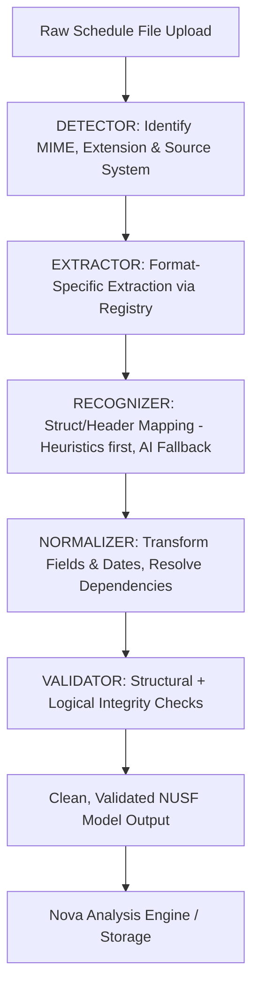

# Nova Universal Schedule Format (NUSF) - LLM Agent Implementation Specification

---

## 1. System Objective & Core Principles

Build a universal normalization layer that ingests ANY schedule file format (Excel, Primavera XER, MSP XML, Asta, PDF, CSV), extracts its raw contents, detects structure and semantics (via deterministic heuristics with an AI fallback), normalizes it into a standardized, unified format, and validates it prior to downstream ingestion by the Nova Analysis Engine.

### Core Principles

1. **Single Source of Truth**: All source format streams are mapped to a single unified schema (`NormalizedSchedule`).
2. **Pipeline Architecture**: Loose coupling via discrete pipeline stages (Detect → Extract → Recognize → Normalize → Validate).
3. **Registry Pattern**: Extractors must register themselves dynamically to support seamless extensibility.
4. **Data Provenance**: Every field normalized must maintain absolute traceability back to its original row, column/field, and extraction mechanism (heuristics vs. AI inference).

---

## 2. Ingestion Pipeline Architecture



---

## 3. Technology Stack & Dependencies

The agent must configure the development environment using the following verified versions:

```ini
# Open Source Python Core
openpyxl==3.10.0      # Excel XLSX Parsing
pydantic>=2.0         # Runtime Data Validation & Settings Management
python-magic==0.4.27  # Binary MIME-type Detection
lxml==4.9.3           # High-Performance XML Parsing (MSP XML)
pandas>=2.0           # Tabular Data Extraction and Reshaping
pytest==7.4.0         # Unit & Integration Testing
python-dotenv>=1.0.0  # Environment Configuration Variable Management
requests>=2.31.0      # HTTP Client (Document Intelligence / LLM API calls)

# Existing Infrastructure (No Additional Installs Required)
FastAPI               # API Routing Layer
PostgreSQL            # Persistence Layer
Redis / Upstash       # Caching Layer (For AI Inference & Session State)
Azure OpenAI          # LLM Services (AI Fallback Recognition)
Azure Document Intelligence # OCR & Document Layout Extraction (PDF parsing)
```

---

## 4. Standard Directory Layout

Implement all source code, fixtures, and configurations exactly according to this directory tree structure:

```text
azure_rag_agent/
├── ingestion/
│   ├── __init__.py
│   ├── pipeline.py                 # Main orchestrator (pipeline entry point)
│   ├── detector.py                 # File type and source format detection
│   ├── cache.py                    # Redis/Upstash caching layer
│   │
│   ├── models/
│   │   ├── __init__.py
│   │   └── nusf.py                 # Pydantic schemas (Source of Truth)
│   │
│   ├── extractors/
│   │   ├── __init__.py
│   │   ├── base.py                 # Abstract base extractor class
│   │   ├── registry.py             # Extractor plugin registry
│   │   ├── excel.py                # Excel extractor (openpyxl)
│   │   ├── primavera.py            # Primavera XER parser/extractor
│   │   ├── msp.py                  # MS Project XML parser
│   │   ├── asta.py                 # Asta Schedule extractor
│   │   ├── pdf.py                  # PDF extractor (Azure Document Intelligence)
│   │   └── csv.py                  # Standard CSV/TSV extractor
│   │
│   ├── recognition/
│   │   ├── __init__.py
│   │   ├── heuristics.py           # Deterministic tabular header detection
│   │   └── ai_fallback.py          # AI-assisted structure recognition (cached)
│   │
│   ├── normalization/
│   │   ├── __init__.py
│   │   ├── engine.py               # Field normalization and mapping coordinator
│   │   ├── dates.py                # Date parser (supports variable/complex patterns)
│   │   ├── relationships.py        # Graph dependency resolution and lag calculator
│   │   └── mappings.py             # Config-driven field mapper
│   │
│   ├── validation/
│   │   ├── __init__.py
│   │   ├── engine.py               # Structural, logical, and semantic validator
│   │   └── issues.py               # Validation issue classifications
│   │
│   └── routes/
│       ├── __init__.py
│       └── ingestion.py            # FastAPI endpoints
│
├── tests/
│   ├── fixtures/
│   │   ├── excel_clean.xlsx
│   │   ├── excel_messy.xlsx
│   │   ├── primavera_sample.xer
│   │   ├── msp_sample.xml
│   │   ├── asta_sample.csv
│   │   └── expected_outputs/
│   │       ├── excel_clean_nusf.json
│   │       ├── primavera_nusf.json
│   │       └── msp_nusf.json
│   ├── test_detector.py
│   ├── test_extractors.py
│   ├── test_normalization.py
│   ├── test_validation.py
│   └── test_integration.py
│
└── config/
    ├── __init__.py
    └── mappings/
        ├── primavera_xer.yaml      # Default XER column mappings
        ├── msp_xml.yaml            # Default MSP XML field mappings
        ├── asta.yaml               # Default Asta column mappings
        └── excel.yaml              # Default Excel heuristics column mappings
```

---

## 5. Pydantic Models: The NUSF Schema (Source of Truth)

All pipeline data models must inherit from `pydantic.BaseModel` (v2 style). Store the code below in [ingestion/models/nusf.py](file:///c:/work/gac/nova/NUSF/azure_rag_agent/ingestion/models/nusf.py).

```python
from pydantic import BaseModel, Field
from datetime import datetime
from enum import Enum
from typing import List, Optional, Dict, Any
import uuid

class DependencyType(str, Enum):
    FS = "FS"  # Finish-to-Start
    SS = "SS"  # Start-to-Start
    FF = "FF"  # Finish-to-Finish
    SF = "SF"  # Start-to-Finish

class ActivityType(str, Enum):
    TASK = "TASK"
    SUMMARY = "SUMMARY"
    MILESTONE = "MILESTONE"
    LOE = "LOE"  # Level of Effort

class Provenance(BaseModel):
    """Tracks field-level source mapping and extraction context"""
    source_field: str = Field(..., description="Original raw column header or field name")
    source_row: Optional[int] = Field(None, description="Zero-indexed row number from raw extraction")
    is_ai_inferred: bool = Field(False, description="Flag indicating if the field required AI extraction fallback")
    confidence: float = Field(1.0, ge=0.0, le=1.0, description="Confidence metric for parsed values")

class Activity(BaseModel):
    """Unified Activity Data Model"""
    # Unique Identifiers
    internal_id: str = Field(..., description="Stable, globally unique ID (derived UUID)")
    source_id: str = Field(..., description="Unchanged native ID from original format")
    name: str = Field(..., description="Activity description/name")

    # WBS Hierarchical Metadata
    wbs_code: Optional[str] = Field(None, description="Work Breakdown Structure hierarchical identifier")
    wbs_level: int = Field(0, ge=0, description="WBS hierarchy depth (0 is root)")
    parent_id: Optional[str] = Field(None, description="Internal ID of the parent activity")

    # Temporal Anchors (ISO 8601 UTC)
    planned_start: datetime = Field(..., description="Scheduled or baseline start timestamp")
    planned_finish: datetime = Field(..., description="Scheduled or baseline finish timestamp")
    actual_start: Optional[datetime] = Field(None, description="Actual start timestamp (if execution started)")
    actual_finish: Optional[datetime] = Field(None, description="Actual finish timestamp (if execution completed)")
    duration_hours: int = Field(..., ge=0, description="Duration in standard working hours")

    # Progress & State
    percent_complete: float = Field(0.0, ge=0.0, le=100.0, description="Percentage completion [0.0 - 100.0]")
    activity_type: ActivityType = Field(ActivityType.TASK, description="Operational classification of active node")

    # Categorization Elements
    discipline: Optional[str] = Field(None, description="Department, trade, or discipline tag")
    phase: Optional[str] = Field(None, description="Project phase or segment")

    # Linked Nodes
    predecessors: List[str] = Field(default_factory=list, description="Array of predecessor internal_ids")
    successors: List[str] = Field(default_factory=list, description="Array of successor internal_ids")

    # Inline Quality Checks
    has_logic_warning: bool = Field(False, description="True if validation anomalies are associated")
    warning_messages: List[str] = Field(default_factory=list, description="Descriptions of semantic validation failures")

    # Origin Mapping Table
    provenance: Dict[str, Provenance] = Field(..., description="Field-to-provenance mapping dictionary")

class Relationship(BaseModel):
    """Network relationship between schedule activities"""
    predecessor_id: str = Field(..., description="Internal ID of predecessor activity")
    successor_id: str = Field(..., description="Internal ID of successor activity")
    lag_hours: int = Field(0, description="Offset lag in hours (can be negative)")
    type: DependencyType = Field(DependencyType.FS, description="Dependency link sequence type")
    is_broken: bool = Field(False, description="Flag indicating invalid, unlinked, or circular paths")
    is_ai_inferred: bool = Field(False, description="True if relationship was derived using AI mapping")

class ValidationIssue(BaseModel):
    """Detailed structural or semantic validation failure details"""
    level: str = Field(..., description="Severity classification: ERROR | WARNING | INFO")
    category: str = Field(..., description="Anomaly classification: STRUCTURAL | LOGICAL | QUALITY")
    activity_id: Optional[str] = Field(None, description="Associated Activity internal_id (if applicable)")
    message: str = Field(..., description="Detailed issue summary and diagnostic description")
    remediation: Optional[str] = Field(None, description="Actionable suggestion to resolve validation error")

class ScheduleMetadata(BaseModel):
    """Schedule-level metrics and tracking data"""
    nusf_version: str = Field("1.0", description="Target schema iteration version")
    project_name: str = Field(..., description="Extracted project title")
    source_system: str = Field(..., description="Original platform, e.g. PRIMAVERA_XER | MSP_XML | EXCEL | PDF")
    source_filename: str = Field(..., description="Native filename uploaded")
    data_date: datetime = Field(..., description="Schedule data reporting cut-off date")

    # High-level Statistics
    total_activities: int = Field(..., ge=0)
    total_relationships: int = Field(..., ge=0)
    earliest_date: datetime = Field(..., description="Min date boundary")
    latest_date: datetime = Field(..., description="Max date boundary")
    duration_days: int = Field(..., ge=0, description="Overall duration calculated from min/max dates")

    # Ingestion Quality Metadata
    parse_quality_score: float = Field(..., ge=0.0, le=1.0, description="Ratio of successfully mapped fields")
    parse_timestamp: datetime = Field(default_factory=datetime.utcnow, description="Pipeline processing date")
    parse_duration_seconds: float = Field(0.0, description="Runtime duration of pipeline processing")

class NormalizedSchedule(BaseModel):
    """Consolidated normalized data envelope"""
    id: str = Field(default_factory=lambda: str(uuid.uuid4()), description="Ingested schedule instance UUID")
    metadata: ScheduleMetadata = Field(..., description="Metadata and overall schedule attributes")
    activities: List[Activity] = Field(..., description="Parsed and normalized activity listing")
    relationships: List[Relationship] = Field(..., description="Parsed dependency networks")
    validation_issues: List[ValidationIssue] = Field(default_factory=list, description="Validation issues caught")
    validation_passed: bool = Field(..., description="Passed threshold requirements flag")
```

---

## 6. Implementation Specifications: Pipeline Steps

An implementation agent must construct the ingestion pipeline utilizing the following structural classes and module specifications.

### Step 1: File Format Detection (`detector.py`)

- **Action**: Check file extensions and binary headers.
- **Rules**:
  - `XER` files start with the tab-separated key block: `ERPROJ` or `SYSASCT`.
  - `XML` files start with standard XML declaration and verify presence of root element `<Project ...>` matching MS Project namespaces.
  - `XLSX` files must be opened using `openpyxl` to confirm structural integrity, catching `InvalidFileException`.
  - Binary checks utilize `python-magic` MIME signatures (`application/pdf`, `text/csv`, etc.).

```python
# SKELETON: ingestion/detector.py
from pathlib import Path
import magic

class FormatDetector:
    def detect(self, file_path: Path) -> tuple[str, str]:
        """Returns (MIME_TYPE, SOURCE_SYSTEM_IDENTIFIER)"""
        # 1. Evaluate file signature using magic
        mime_type = magic.from_file(str(file_path), mime=True)
        ext = file_path.suffix.lower()

        # 2. Inspect contents for structural markers
        with open(file_path, 'rb') as f:
            header = f.read(1024)

        if ext == '.xer' or b'ERPROJ' in header:
            return ('text/plain', 'PRIMAVERA_XER')
        if ext == '.xml' and b'<Project' in header:
            return ('text/xml', 'MSP_XML')
        if ext in ['.xlsx', '.xls']:
            return ('application/vnd.openxmlformats-officedocument.spreadsheetml.sheet', 'EXCEL')
        if ext == '.pdf':
            return ('application/pdf', 'PDF')
        if ext in ['.csv', '.tsv']:
            return ('text/csv', 'CSV')

        return (mime_type, 'UNKNOWN')
```

### Step 2: Extractor Interface & Registry Pattern (`extractors/`)

- **Registry**: Use `registry.py` to cache instantiated class implementations.
- **Base class (`base.py`)**: Abstract Base Class defining standard interface:

```python
# Base: ingestion/extractors/base.py
from abc import ABC, abstractmethod
from typing import Dict, Any
from pathlib import Path

class BaseExtractor(ABC):
    @abstractmethod
    def extract(self, file_path: Path) -> Dict[str, Any]:
        """Read native file stream and convert to intermediate Python data structures.
        Returns a dictionary containing 'headers', 'rows', and context metadata.
        """
        pass

    @abstractmethod
    def source_system(self) -> str:
        """Returns standard system uppercase identifier"""
        pass
```

```python
# Registry: ingestion/extractors/registry.py
from typing import Dict
from .base import BaseExtractor

class ExtractorRegistry:
    _registry: Dict[str, BaseExtractor] = {}

    @classmethod
    def register(cls, source_system: str, extractor: BaseExtractor):
        cls._registry[source_system.upper()] = extractor

    @classmethod
    def get(cls, source_system: str) -> BaseExtractor:
        extractor = cls._registry.get(source_system.upper())
        if not extractor:
            raise ValueError(f"No extractor registered for source system: {source_system}")
        return extractor
```

_Every implementation (e.g. `excel.py`, `primavera.py`, `msp.py`) must implement `BaseExtractor` and register itself to the registry._

### Step 3: Header Recognition Engine (`recognition/`)

Determines which columns map to critical activity fields (ID, Name, Start, Finish, Duration).

1. **Heuristics (`heuristics.py`)**:
   - Compares raw headings against predefined token arrays (e.g., `["activity id", "act id", "task_id", "uid"]` → `source_id`).
   - Uses Jaro-Winkler or Levenshtein distance metrics (threshold = 0.85) to map near matches.
2. **AI Fallback (`ai_fallback.py`)**:
   - If critical fields (Name, Start, Finish) cannot be resolved deterministically, payload goes to Azure OpenAI Chat Completions.
   - **System Prompt**:
     > Interpret this set of column headers: `{headers}` from a project schedule. Map each required target schema field: `[source_id, name, planned_start, planned_finish, duration]` to the most semantic match from the provided header array. Respond with a strict JSON object only.
   - **Cache Check**: Cache mapping results in Redis with a hash key of sorted raw headers to prevent redundant API latency.

### Step 4: Normalization Engine (`normalization/`)

Translates native data blocks into clean, typed lists of Pydantic models.

- **Date Parser (`dates.py`)**: Must handle multiple format strings:
  - ISO 8601: `YYYY-MM-DDTHH:MM:SSZ`
  - US Styles: `MM/DD/YYYY HH:MM` or `MM/DD/YY`
  - Primavera format: `DD-MMM-YY HH:MM:SS` (e.g. `12-JAN-26 08:00:00`)
- **Relationship Resolver (`relationships.py`)**:
  - Builds graph structures using Activity references.
  - Generates cross-referenced lists of `predecessors` and `successors`.
  - Parses dependency notations, e.g. `1024FS+24` (Predecessor: `1024`, Type: `FS`, Lag: `24` hours).

### Step 5: Data Validator (`validation/`)

- Checks structural and logic boundaries on the fully assembled `NormalizedSchedule` object.
- **Validation Rules**:
  - **Rule 101**: Dates must follow logic: `planned_start <= planned_finish`. Error if violated.
  - **Rule 102**: Circular dependencies. Build adjacency list of activities and run DFS to detect cycles. Categorize as `ERROR`, `category = LOGICAL`.
  - **Rule 103**: Dangling references. Verify every relationship has registered `predecessor_id` and `successor_id` values within the list of activities.
  - **Rule 104**: Out-of-Sequence Progress. Check if activities with `percent_complete > 0` have missing `actual_start`. Categorize as `WARNING`, `category = QUALITY`.

---

## 7. Adding a New Source Format

To introduce an additional format mapping structure, strictly execute the following five-step process:

```text
               +-------------------------------------------+
               |  Step 1: Write Custom Extractor Class     |
               |  (Inherit BaseExtractor, Register to Registry) |
               +-------------------------------------------+
                                     |
                                     v
               +-------------------------------------------+
               |  Step 2: Append Signature Check Logic     |
               |  (Update FormatDetector class in detector.py) |
               +-------------------------------------------+
                                     |
                                     v
               +-------------------------------------------+
               |  Step 3: Define Static Mapping Profiles   |
               |  (Create config/mappings/your_system.yaml) |
               +-------------------------------------------+
                                     |
                                     v
               +-------------------------------------------+
               |  Step 4: Generate Mock Test Fixtures      |
               |  (Save sample.ext & output JSON mock tests) |
               +-------------------------------------------+
                                     |
                                     v
               +-------------------------------------------+
               |  Step 5: Run Automated Pipeline Execution  |
               |  (Run: pytest tests/test_extractors.py)   |
               +-------------------------------------------+
```

### Complete Implementation Example for Format Addition:

#### 1. Implement and Register Extractor:

```python
# ingestion/extractors/custom_sys.py
from pathlib import Path
from typing import Dict, Any
from .base import BaseExtractor
from .registry import ExtractorRegistry

class CustomSysExtractor(BaseExtractor):
    def extract(self, file_path: Path) -> Dict[str, Any]:
        # Perform custom parsing operations
        extracted_rows = []
        # [Custom parsing logic goes here]
        return {
            "source_system": self.source_system(),
            "headers": ["TaskID", "TaskName", "Start", "Finish"],
            "rows": extracted_rows,
            "file_name": file_path.name
        }

    def source_system(self) -> str:
        return "CUSTOM_SYS"

# Register the class to runtime collection
ExtractorRegistry.register("CUSTOM_SYS", CustomSysExtractor())
```

#### 2. Detect Format in `detector.py`:

```python
# Add matching signature parsing to FormatDetector
if ext == '.csy' or b'CUSTOM_SYS_MARKER' in header:
    return ('application/octet-stream', 'CUSTOM_SYS')
```

#### 3. Define mapping profile `config/mappings/custom_sys.yaml`:

```yaml
source_id: "TaskID"
name: "TaskName"
planned_start: "Start"
planned_finish: "Finish"
duration: "Duration"
```

---

## 8. Verification & Execution Framework

Validate the structural robustness of the ingestion layer using standard pytest automation hooks.

### Execution Target Checklist

```bash
# Execute parser verification suite
pytest tests/test_detector.py
pytest tests/test_extractors.py
pytest tests/test_normalization.py
pytest tests/test_validation.py

# Execute full pipeline integration verification
pytest tests/test_integration.py
```

### Mock Validation Testing Data Model

All tests must verify boundary validation outputs. Ensure that parsing a valid file generates a model where `validation_passed == True` and `validation_issues` has length `0`. Conversely, parsing an invalid schedule fixture must generate appropriate structural validation errors with a score metric below `1.0`.
